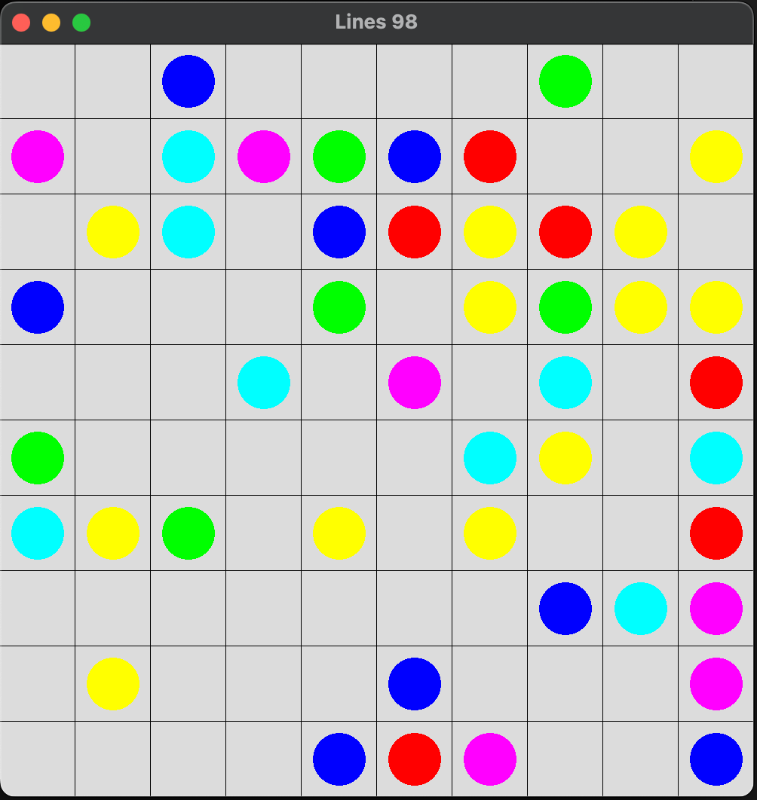

# Lines98 in Cpp 
Lines98 Game using SFML.
Target to build and run on multiple platforms (Mac, Windows, Linux)

# Compile

## Cmake
```
git submodule update --init --recursive
mkdir build
cd build
cmake ../
cmake --build .
```

# Build and run
```
make
make run
```

# Screenshot
